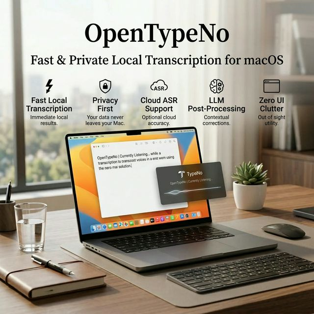

# OpenTypeNo

[English](README.md) | [中文](README_CN.md)

**無料・オープンソース・プライバシー優先の macOS 音声入力ツール。**



ミニマルな macOS 音声入力アプリ。OpenTypeNo はあなたの声をキャプチャし、ローカルで文字起こしし、使用中のアプリに自動ペーストします — すべて1秒以内。

本プロジェクトはオリジナルの [TypeNo](https://typeno.com) プロジェクトから派生したものです。特別な感謝の意を表します。

ローカル音声認識を支える [marswave ai の coli プロジェクト](https://github.com/marswaveai/coli) に感謝します。

## 使い方

1. **Control を短く押す**（デフォルト。カスタマイズ可能）と録音開始
2. **もう一度 Control を短く押す** と停止
3. テキストが自動的に文字起こしされ、アクティブなアプリにペーストされます（クリップボードにもコピー）

OpenTypeNo は邪魔にならず、主にバックグラウンドで動作します。

## インストール

### 方法 1：アプリをダウンロード

- [OpenTypeNo for macOS をダウンロード](https://github.com/vivilin-ai/OpenTypeNo/releases/latest)
- 最新の `OpenTypeNo.app.zip` をダウンロード
- 解凍して `OpenTypeNo.app` を `/Applications` に移動
- OpenTypeNo を起動

OpenTypeNo は Apple の署名と公証済みです。警告なしでそのまま開けます。

### 音声認識エンジンをインストール

OpenTypeNo はローカル音声認識に [coli](https://github.com/marswaveai/coli) を使用します：

```bash
npm install -g @marswave/coli
```

未インストールの場合、アプリ内でガイダンスが表示されます。

### 初回起動

OpenTypeNo には一度だけ次の2つの権限が必要です：
- **マイク** — 音声を録音するため
- **アクセシビリティ** — テキストをアプリに貼り付けるため

初回起動時にアプリが権限付与を案内します。

### 方法 2：ソースからビルド

```bash
git clone https://github.com/vivilin-ai/OpenTypeNo.git
cd OpenTypeNo
scripts/generate_icon.sh
scripts/build_app.sh
```

アプリは `dist/OpenTypeNo.app` に生成されます。権限を維持するため `/Applications/` に移動してください。

## 操作方法・機能

| 操作 | トリガー |
|---|---|
| 録音の開始/停止 | `Control` を短く押す（カスタマイズ可能: ⌃, ⌥, ⌘, ⇧） |
| トリガーモード | シングルタップまたはダブルタップ |
| 録音の開始/停止 | メニューバー → Record |
| ファイルの文字起こし | `.m4a`/`.mp3`/`.wav`/`.aac` をメニューバーアイコンにドラッグ |
| 設定を開く | メニューバー → Settings...（`,`） |
| アップデート確認 | メニューバー → Check for Updates... |
| 終了 | メニューバー → Quit（`⌘Q`） |

### 詳細設定

メニューバーから設定ウィンドウを開くと、以下のカスタマイズが可能です：
- **文字起こしモード**: ローカルでプライバシー優先の文字起こし（`coli`）、またはより高精度な**クラウド ASR**（OpenAI Whisper、要 API Key）から選択できます。
- **後処理**: LLM (DeepSeek / Kimi 対応、要 API Key) を利用し、自動的な句読点の追加・フィラーワードの削除・誤字の修正を行います。

## 設計思想

OpenTypeNo がフォーカスするのは：音声 → テキスト → ペースト の一点です。余計な UI を最小限に抑えています。最速のタイピングは、タイピングしないこと。

## Star History

[](https://star-history.com/#vivilin-ai/OpenTypeNo&Date)

## ライセンス

GNU General Public License v3.0
